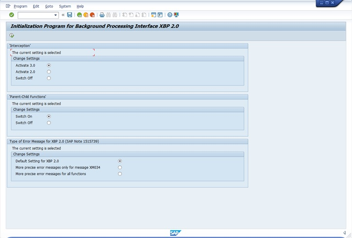
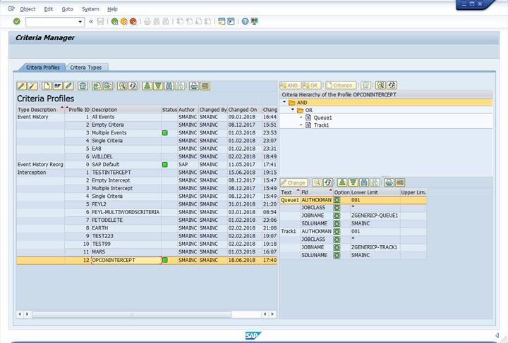
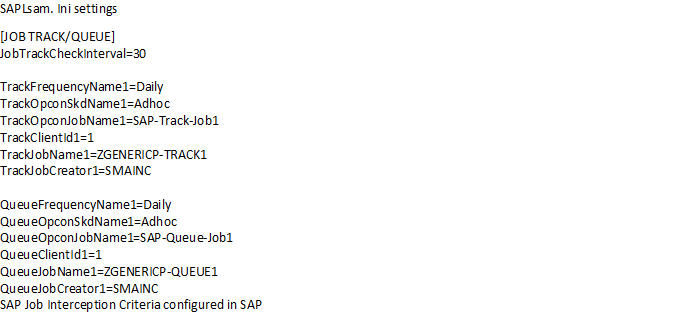

# SAPLSAM.ini configuration file

The SAPLSAM.ini is the SAP LSAM configuration filename. The location of the SAPLSAM.ini file is in the <Configuration Directory\>\\SAP LSAM\\ directory.

:::note
The Configuration Directory is based on where you installed your programs. For more information, refer to [File Locations](https://help.smatechnologies.com/opcon/core/latest/Files/Concepts/File%20Locations.htm) in the **Concepts** online help.
:::

The following settings are critical to the operation of the LSAM with OpCon:

- **MaximumNumberOfJobs**: This value determines the maximum number of jobs the LSAM is allowed to process concurrently.
- **SocketNumberToSAM**: This value is used for communication between the LSAM and the SMANetCom; consequently, the value for this setting and the value for the Socket Number on the Machines screen in the Enterprise Manager (EM) must match.
- **JORSSocket**: This value is used for communicating job output information with the Enterprise Manager (EM).

Modify the SAPLSAM.ini File

1. Right-click on the **Start** button.
2. Select **Explore** from the menu.
3. Browse to <Configuration Directory\>\\**SAP LSAM**\\ for the desired SAP LSAM instance.
4. Find the **SAPLSAM.ini** file.
5. Right-click the file and select **Open With**.
6. Select an ASCII text editor (e.g., Notepad) from the **Choose the program you want use** list box.
7. In the text editor, make any necessary modifications to the .ini file. For complete information on the SAPLSAM.ini settings, refer to the related topics.
8. Use menu path: **File \> Save**.
9. **Close ☒** the text editor.

Encrypt the User for the SAP Account

1. Log in to the Enterprise Manager.
2. Use menu path: **EnterpriseManager \> Password Update \> Password encryption tool**.
3. *(Optional)* Mark the **Visible** check box to make the password characters visible in the Password encryption tool.
4. In **Password** field, enter the password.
5. Click **Encrypt**.
6. To copy the encrypted password, click the **Copy to Clipboard** button.
7. Open the **SAPLSAM.ini** file. Refer to the procedure [Modify the SAPLSAM.ini File](#Modify_the_SAPLSAM.ini_File) for  more information on opening the SAPLSAM.ini file.
8. Locate **User** under the **SAP System** settings in the SAPLSAM.ini file in the Text editor.
9. Delete the default value for the User name.
10. Paste the encrypted code as the User name.
    a.  Right-click and select **paste** **- or -**
    b.  Press **CTRL+V**.

Encrypt the Password for the SAP Account

1. Log in to the Enterprise Manager:
2. Use menu path: **EnterpriseManager \> Password Update \> Password encryption tool**.
3. *(Optional)* Mark the **Visible** check box to make the password characters visible in the Password encryption tool.
4. In **Password** field, enter the password.
5. Click **Encrypt**.
6. To copy the encrypted password, click the **Copy to Clipboard** button.
7. Open the **SAPLSAM.ini** file. Refer to the procedure [Modify the SAPLSAM.ini File](#Modify_the_SAPLSAM.ini_File) for more information on opening the SAPLSAM.ini file.
8. Locate **Password** under the **SAP System** settings in the SAPLSAM.ini file in the Text editor.
9. Delete the default value for the Password.
10. Paste the encrypted code as the Password.
    a.  Right-click and select **paste** **- or -**
    b.  Press **CTRL+V**.

## General settings

The following table contains the basic settings for the SAP LSAM.

|[General Settings]|Default|Dynamic|Required|Description|
|--- |--- |--- |--- |--- |
|DisplaySerivceName|SMA OpCon Agent for SAP|N|Y|The service name displayed in the Service Control Manager. The name must be unique for each SAP LSAM. Do not change this unless there are more than one LSAM on this physical machine.|
|ShortServiceName|SMA_SAPLSAM|N|Y|The hidden, internal (i.e., registry) service name Windows refers to. The name must be unique for each SAP LSAM. Do not change this unless there is more than one LSAM on this physical machine.|
|MaximumNumberOfJobs|10|N|Y|Defines the maximum number of jobs the LSAM can simultaneously manage. When setting the MaximumNumberOfJobs, consider the SAP LSAM machine's processor speed and memory (RAM) size. No jobs process when this setting is zero. Although the maximum value allowed is 500, typical customer usage ranges from 10 to 30 jobs.|
|JobStatusCheckInterval|30|Y|Y|Defines the interval in seconds at which the SAP LSAM polls the SAP system for each job's status. Supported values range from 5 to 300.|
|MaxSpoolSizeToRetrieve|1000000|Y|N|Defines the maximum size in bytes of the spoollist to retrieve from the SAP side when Version is set to 3.0 in the SAP Systems section of the configuration file. If a spoollist is larger than the specified size, it will not be retrieved and will not be available through View Job Output.|
|MaxJobLogSizeToRetrieve|1000000|Y|N|Defines the maximum size in bytes of the joblog to retrieve from the SAP side. If a joblog is larger than the specified size, it will not be retrieved and will not be available through View Job Output.|
|CaptureOutputBeforeJobFin|False|Y|N|When True, this configures the LSAM so that it sends back a final Job status to SAM as soon as job finishes on the SAP side. The LSAM later goes on to grab the joblog/spool files. The only drawback here is they cannot immediately do a View Job Output as soon as the job finishes because we might still be in the process of gathering logs. Valid values include True and False.|
|BapiResponseTimeout|300|Y|Y|Defines the timeout value (in seconds) for any BAPI call made into the SAP system. If the API call does not respond with success or failure within this time, the connection to SAP host is considered dead and a new connection into the system is attempted. Supported values range from 180 to 600.|
|ExternalEventUser|Blank|Y|Y|Defines the external event user.|
|ExternalEventPassword|Blank|Y|Y|Defines the password for the external event.|

## TCP/IP parameters

The following table contains the network settings for the SAP LSAM.

:::warning
Enter all alphabetic TCP/IP parameter values in uppercase. The SAP LSAM service does not start if the values are in lowercase.
:::

|[TCP/IP Parameters]|Default|Dynamic|Required|Description|
|--- |--- |--- |--- |--- |
|SocketNumberToSAM|14100|N|Y|Defines the socket number through which the LSAM and the SMANetCom communicate. This number must match the Machine's socket number defined in the OpCon Enterprise Manager. If there are multiple SAP LSAMs installed on one machine, each LSAM must have a unique value. For an up-to-date list of unused ports, please refer to the Internet Assigned Numbers Authority at www.iana.org.|
|QueryListenerPort|14101|N|N|Defines the port on which the SAP LSAM listens for proxy requests. Note: Firewall settings will need to allow connections on this port on the SAP LSAM.|
|AllowedIPAddress_1|ANY|Y|N|Determines if communication from the SMANetCom to the LSAM is restricted to one or more TCP/IP addresses. If ANY is specified, the LSAM accepts communication from any TCP/IP address. If a specific TCP/IP address is defined (e.g., 126.40.90.231), the LSAM only accepts communication from the specified address. The LSAM refuses a connection if communication is attempted from another address. This definition enhances communication security by refusing communications from other TCP/IP addresses. If multiple SAMs are on a network, this address ensures the LSAM is only accepting messages from the intended SMANetCom. This parameter is case-sensitive.|
|AllowedIPAddress_2||Y|N|Same as Address_1 explanation.|
|AllowedIPAddress_3||Y|N|Same as Address_1 explanation.|
|AllowedIPAddress_4||Y|N|Same as Address_1 explanation.|
|AllowedIPAddress_5||Y|N|Same as Address_1 explanation.|

## Process creation parameters

The following table contains the process creation options for SAP chains.

|[Process Creation Options]|Default|Dynamic|Required|Description|
|--- |--- |--- |--- |--- |
|CaptureJobOutput|TRUE|Y|N|Enables/Disables the creation of job output files for each OpCon job. If set to TRUE, the LSAM saves the output from each started job in a subdirectory (under the MSLSAM directory) called JobOutput. The LSAM saves each job's output to unique files named with the following syntax:"*OpCon job name up to 12 chars*_*unique number*.TXT". View Job Output feature works only if this setting is TRUE.|

## Debug options

The following table contains the log and trace settings for troubleshooting the SAP LSAM.

:::warning
Enter all alphabetic debug option parameter values in uppercase. The SAP LSAM services do not start if the values are in lowercase.
:::

|[Debug Options]|Default|Dynamic|Required|Description|
|--- |--- |--- |--- |--- |
|MaximumLogFileSize|150000|Y|N|Sets the maximum size in bytes for each LSAM log file. Prevents the accumulation of log messages in a single file. This is a site-specific setting.|
|ArchiveDaystoKeep|10|Y|N|Determine how many archive folders should be retained. Each time it archives a log, the SAP LSAM checks for expired archive folders to delete.|
|TraceSAMMessages|ON|N|N|Enables/Disables tracing of messages to and from SMANetCom. The SAPLSAMTrace.log file contains the trace messages. If ON, the LSAM traces messages. If OFF, the LSAM does not trace messages.|
|TraceLevel|0|Y|N|Enables/Disables tracing of any debug messages created by the LSAM. The SAPBWLSAM.log file contains the traced messages. If 0, only the LSAM failure debug messages are traced (minimal log). If 1, additional LSAM debug messages are traced. If 2, detailed LSAM debug messages are traced.|

## SAP system settings

The following table contains the LSAM connection information to the SAP system.

|[SAP System]|Default|Dynamic|Required|Description|
|--- |--- |--- |--- |--- |
|Name|SAPSYSTEM|N|Y|The name of the SAP machine as defined in the OpCon Enterprise Manager (EM).|
|ClientID|0|N|Y|The Client ID for connecting to the SAP System. Valid values are three-digit numbers ranging from 000 to 999.|
|Gateway|/H/127.0.0.1/H/test801|N|Y|Defines the full connection string for SAP system. If connecting to an SAP machine within a network, a standard TCP/IP address is acceptable. If connecting through an ISDN line or some other mechanism, a complete router connection string is required. The following is a router connection string: /H/127.0.0.1/H/cpce801. cpce801 is the SAP machine name. 127.0.0.1 is the TCP/IP address of the SAP machine.|
|SystemNumber|0|N|Y|The System number for connecting to SAP system. Valid values are two-digit numbers ranging from 00 to 99.|
|R3Name||N|N|When an MSHOST is defined for the Gateway setting, the value for the R3Name is required to define the SAP R/3 instance name.|
|Group||N|N|Optionally defines the name of the SAP server group for a load balancing connection when an MSHOST is defined for the Gateway setting.|
|RFCTrace|0|N|Y|Enables/Disables SAP RFC tracing. If 0, SAP RFC tracing does not occur. If 1, SAP RFC tracing occurs.|
|User||N|Y|Sets the User for connecting to the SAP system. The LSAM requires a user with the S_XMI_ALL privilege. To encrypt the User name, follow the procedure in Encrypt the User for the SAP Account.|
|Password||N|Y|Sets the password for the User connecting to the SAP system. To encrypt the Password, follow the procedure in Encrypt the Password for the SAP Account.|
|Version|3.0|N|N|Describes the version of XBP interface used for interacting with the SAP system. Valid values are 2.0 or 3.0.|

## Job Track/Queue settings

The following table contains the settings for tracking jobs started outside OpCon on the SAP system.

Multiple jobs can be defined for tracking or queuing by creating groups of "Track" and "Queue" entries and changing the suffix (1) to a new unique value within each group (e.g., TrackFrequencyName2, QueueFrequencyName1, etc.).

In order for job tracking or queuing to work, please configure and activate a job intercept profile in SAP to match the Job Track/Queue configuration in the SAPLsam.ini file and run INITXBP2 on the SAP system; make sure Interception 3.0 is activated. The following images provide an example of setting up this process.

### Initialization Program for Background Processing Interface XBP 2.0

### Criteria Manager

### SAPLsam.ini Settings

+|[Job Track/Queue Settings]|Default|Dynamic|Required|Description|
|--- |--- |--- |--- |--- |
|JobTrackCheckInterval|30|Y|N|This defines the frequency in seconds for checking tracked/queued jobs on the SAP system. Define this option only one time in the Job Track/Queue Settings section.|
|TrackFrequencyName1||Y|N|Defines the frequency name configured in OpCon for this tracked job.|
|TrackOpconSkdName1||Y|N|Defines the schedule name as configured in OpCon for this tracked job.|
|TrackOpconJobName1||Y|N|Defines the job name as configured in OpCon for this tracked job.|
|TrackClientId1||Y|N|Defines the client id under which the tracked job starts on the R/3 or CRM system.|
|TrackJobName1||Y|N|Defines the job name defined in the R/3 or CRM system for the tracked job. Wildcards \* and ? can be used while defining this field.|
|TrackJobCreator1||Y|N|Defines the job creator defined for the tracked job in the R/3 or CRM system. Wildcards \* and ? can be used while defining this field.|
|QueueFrequencyName1||Y|N|Defines the frequency name configured in OpCon for this queued job.|
|QueueOpconSkdName1||Y|N|Defines the schedule name as configured in OpCon for this queued job.|
|QueueOpconJobName1||Y|N|Defines the job name as configured in OpCon for this queued job.|
|QueueClientId1||Y|N|Defines the client id under which the queued job starts on the R/3 or CRM system.|
|QueueJobName1||Y|N|Defines the job name defined in the R/3 or CRM system for the queued job. Wildcards \* and ? can be used while defining this field.|
|QueueJobCreator1||Y|N|Defines the job creator defined for the queued job in the R/3 or CRM system. Wildcards \* and ? can be used while defining this field.|

## JORS settings

The following table contains the network settings for the SAP JORS component.

| [JORS Settings] | Default | Dynamic | Required | Description |
|---|---|---|---|---|---|
| JORSSocket | 14110 | N | Y | Defines the socket number used for communicating job output information with the Enterprise Manager (EM). This number must match the Machine's JORS Port Number defined in the OpCon Enterprise Manager. If there are multiple SAP LSAMs installed on one machine, each LSAM requires a unique JORS socket number.

:::note
The JORSSocket needs to be set in both the LSAM ini file and the advanced machine settings in the EM. For more information on modifying the JORSSocket number, refer to the Configuring Advanced Machine Parameters and Properties in the Enterprise Manager online help.
:::
