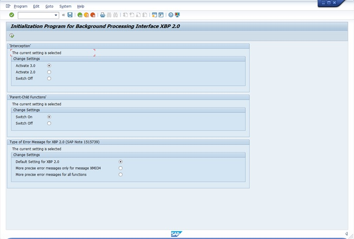
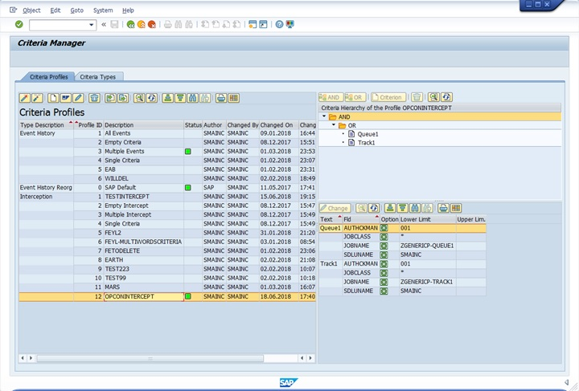
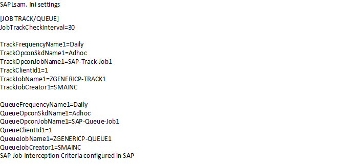

# SAPLSAM.ini configuration file

## What is it?

SAPLSAM.ini is the configuration file the SAP Agent reads at startup and re-reads when changes are detected. It controls how the agent identifies itself as a Windows service, how it communicates with OpCon, how it connects to the SAP system, and how it handles job tracking, output retrieval, and logging.

The file lives in the `<Configuration Directory>\SAP LSAM\` directory.

:::note
The Configuration Directory is based on where you installed your programs. For more information, refer to [File Locations](https://help.smatechnologies.com/opcon/core/file-locations) in the **Concepts** online help.
:::

## How to read this page

Each section below documents one section of the SAPLSAM.ini file. Tables list every setting in that section with the same four-column reference layout.

### Column meanings

| Column | What it means |
|---|---|
| **Default** | The value SAPLSAM.ini ships with. Blank means the value is empty by default. |
| **Dynamic** | **Y** = the agent picks up a change without a restart. **N** = you must restart the SAP Agent service after changing this value. |
| **Required** | **Y** = the setting must have a value for the agent to start or function. **N** = the setting is optional. |
| **Description** | What the setting does and any constraints. |

### Conventions

- Section headings in SAPLSAM.ini are written `[Section Name]` in the file itself, but appear without brackets in this reference.
- Alphabetic values in **TCP/IP Parameters** and **Debug Options** must be uppercase. The service does not start if they are lowercase.
- See [Modify the SAPLSAM.ini file](#modify-the-saplsamini-file) before making any changes.

## Sections in SAPLSAM.ini

| Section | Purpose |
|---|---|
| [General settings](#general-settings) | Service name, concurrency, polling, output retrieval limits |
| [TCP/IP parameters](#tcpip-parameters) | Communication ports and IP allowlist for SMANetCom |
| [Process creation parameters](#process-creation-parameters) | Whether and how the agent saves job output |
| [Debug options](#debug-options) | Log size, archive retention, and trace levels |
| [SAP system settings](#sap-system-settings) | Connection details, credentials, and XBP version |
| [Job Track/Queue settings](#job-trackqueue-settings) | Definitions for tracking or queuing SAP-initiated jobs |
| [JORS settings](#jors-settings) | Socket used by the JORS service to deliver output to the EM |

## Critical settings to verify first

Three settings must be correct before the SAP Agent can do useful work. Verify these first when troubleshooting a brand-new install or a service that won't start.

| Setting | Section | Why it matters |
|---|---|---|
| **MaximumNumberOfJobs** | General settings | If set to `0`, no jobs run on this agent. |
| **SocketNumberToSAM** | TCP/IP parameters | Must match the **Socket Number** on the OpCon machine record so SMANetCom can reach the agent. |
| **JORSSocket** | JORS settings | Must match the **JORS Port Number** on the OpCon machine record so the EM can retrieve job output. |

---

## Procedures

### Modify the SAPLSAM.ini file {#modify-the-saplsamini-file}

To modify the SAPLSAM.ini file, complete the following steps:

1. Right-click the **Start** button and select **Explore** from the menu.
2. Browse to `<Configuration Directory>\SAP LSAM\` for the desired SAP Agent instance.
3. Right-click the **SAPLSAM.ini** file and select **Open With**.
4. Select an ASCII text editor (for example, Notepad) from the **Choose the program you want to use** list box.
5. Edit the settings you need to change. For complete information on each setting, see the section reference tables below.
6. Go to **File > Save**.
7. Close the text editor.

:::tip
If you only changed dynamic settings (marked **Y** in the Dynamic column), the agent picks up the change automatically. If any non-dynamic setting changed, restart the SAP Agent service. See [Managing the SAP Agent](./manage-lsam.md).
:::

### Encrypt SAP credentials in SAPLSAM.ini

The SAP **User** and **Password** values must be entered as encrypted strings in SAPLSAM.ini. Both values use the same encryption tool and the same procedure — only the target field in SAPLSAM.ini differs.

#### Generate an encrypted value

To generate an encrypted value, complete the following steps:

1. Log on to the Enterprise Manager.
2. Go to **Enterprise Manager > Password Update > Password encryption tool**.
3. *(Optional)* Mark the **Visible** check box to show the password characters.
4. In the **Password** field, enter the user name or password you want to encrypt.
5. Select **Encrypt**.
6. Select **Copy to Clipboard**.

#### Paste the encrypted value into SAPLSAM.ini

To paste the encrypted value into SAPLSAM.ini, complete the following steps:

1. Open `SAPLSAM.ini` — see [Modify the SAPLSAM.ini file](#modify-the-saplsamini-file).
2. Locate the target field under the **SAP System** section:

   | Encrypting | Target field |
   |---|---|
   | The SAP login user name | **User** |
   | The SAP login password | **Password** |
3. Delete the existing value for the target field.
4. Paste the encrypted value (right-click and select **Paste**, or press **CTRL+V**).
5. Save and close the file.

Repeat both procedures with each value (user, then password) you need to encrypt.

---

## Setting reference

### General settings

Basic identity, concurrency, polling, and output-size settings for the SAP Agent.

| Setting | Default | Dynamic | Required | Description |
|---|---|---|---|---|
| **DisplayServiceName** | SMA OpCon Agent for SAP | N | Y | The service name displayed in the Service Control Manager. Must be unique per SAP Agent on the host. Do not change unless more than one agent is installed on the same machine. |
| **ShortServiceName** | SMA_SAPLSAM | N | Y | The hidden internal (registry) service name Windows uses. Must be unique per SAP Agent on the host. Do not change unless more than one agent is installed on the same machine. |
| **MaximumNumberOfJobs** | 10 | N | Y | Maximum number of jobs the SAP Agent can process concurrently. Consider the host's CPU and memory. `0` means no jobs run. Maximum is 500; typical range is 10 to 30. |
| **JobStatusCheckInterval** | 30 | Y | Y | Seconds between SAP polls for each job's status. Valid range: 5 to 300. |
| **MaxSpoolSizeToRetrieve** | 1000000 | Y | N | Maximum spoollist size in bytes to retrieve when **Version** is `3.0`. Spoollists larger than this are not retrieved and are not available through View Job Output. |
| **MaxJobLogSizeToRetrieve** | 1000000 | Y | N | Maximum job log size in bytes to retrieve. Job logs larger than this are not retrieved and are not available through View Job Output. |
| **CaptureOutputBeforeJobFin** | False | Y | N | When `True`, the agent reports final job status to SAM as soon as the SAP job finishes, then captures the joblog and spool. The trade-off: View Job Output may not be immediately available because the agent is still gathering logs. Valid values: `True`, `False`. |
| **BapiResponseTimeout** | 300 | Y | Y | Seconds to wait for any BAPI call into the SAP system. If the call does not respond within this time, the connection is treated as dead and a new connection is attempted. Valid range: 180 to 600. |
| **ExternalEventUser** | *(blank)* | Y | Y | The external event user. |
| **ExternalEventPassword** | *(blank)* | Y | Y | The password for the external event user. |

### TCP/IP parameters

Communication ports and an optional IP allowlist for traffic from SMANetCom.

:::warning
Enter all alphabetic TCP/IP parameter values in uppercase. The SAP Agent service does not start if the values are in lowercase.
:::

| Setting | Default | Dynamic | Required | Description |
|---|---|---|---|---|
| **SocketNumberToSAM** | 14100 | N | Y | The socket the SAP Agent and SMANetCom communicate on. Must match the **Socket Number** on the OpCon machine record. Each agent on the same host must have a unique value. For unused-port guidance, see the [Internet Assigned Numbers Authority](https://www.iana.org/). |
| **QueryListenerPort** | 14101 | N | N | The port the SAP Agent listens on for proxy requests. Open this port in the host firewall. |
| **AllowedIPAddress_1** | ANY | Y | N | Restricts SMANetCom traffic to one or more TCP/IP addresses. `ANY` accepts traffic from any source. A specific address (for example, `126.40.90.231`) restricts traffic to that source. The agent rejects connections from any other address. Useful when multiple SAMs share a network. Case-sensitive. |
| **AllowedIPAddress_2** | *(blank)* | Y | N | Same behavior as **AllowedIPAddress_1**. |
| **AllowedIPAddress_3** | *(blank)* | Y | N | Same behavior as **AllowedIPAddress_1**. |
| **AllowedIPAddress_4** | *(blank)* | Y | N | Same behavior as **AllowedIPAddress_1**. |
| **AllowedIPAddress_5** | *(blank)* | Y | N | Same behavior as **AllowedIPAddress_1**. |

### Process creation parameters

Process creation options for SAP chains.

| Setting | Default | Dynamic | Required | Description |
|---|---|---|---|---|
| **CaptureJobOutput** | TRUE | Y | N | When `TRUE`, the agent saves output from each started job in the `JobOutput` subdirectory under MSLSAM. Files are named `<OpCon job name (≤12 chars)>_<unique number>.TXT`. View Job Output works only when this is `TRUE`. |

### Debug options

Log size, archive retention, and trace verbosity for troubleshooting.

:::warning
Enter all alphabetic debug option parameter values in uppercase. The SAP Agent services do not start if the values are in lowercase.
:::

| Setting | Default | Dynamic | Required | Description |
|---|---|---|---|---|
| **MaximumLogFileSize** | 150000 | Y | N | Maximum size in bytes per agent log file. Forces rotation so a single file does not grow unbounded. Site-specific. |
| **ArchiveDaystoKeep** | 10 | Y | N | How many archive folders to retain. The agent purges expired folders during each archive. |
| **TraceSAMMessages** | ON | N | N | Enables tracing of messages between the agent and SMANetCom into `SAPLSAMTrace.log`. Valid values: `ON`, `OFF`. |
| **TraceLevel** | 0 | Y | N | Verbosity of debug messages written to `SAPBWLSAM.log`. `0` = failures only (minimal). `1` = additional debug. `2` = detailed debug. |

### SAP system settings

Connection details, credentials, and XBP version for the SAP system the agent talks to.

| Setting | Default | Dynamic | Required | Description |
|---|---|---|---|---|
| **Name** | SAPSYSTEM | N | Y | The name of the SAP machine as defined in the OpCon Enterprise Manager (EM). |
| **ClientID** | 0 | N | Y | Client ID for the SAP system connection. Valid values: three-digit numbers `000` to `999`. |
| **Gateway** | /H/127.0.0.1/H/test801 | N | Y | The full SAP connection string. A standard TCP/IP address works for SAP machines on a network. ISDN or other links require a router connection string (for example, `/H/127.0.0.1/H/cpce801`, where `cpce801` is the SAP machine name and `127.0.0.1` is its IP address). |
| **SystemNumber** | 0 | N | Y | The system number for the SAP system connection. Valid values: two-digit numbers `00` to `99`. |
| **R3Name** | *(blank)* | N | N | When **Gateway** uses an MSHOST, this defines the SAP R/3 instance name. |
| **Group** | *(blank)* | N | N | When **Gateway** uses an MSHOST, this optionally defines the SAP server group for a load-balancing connection. |
| **RFCTrace** | 0 | N | Y | Enables SAP RFC tracing. `0` = off. `1` = on. |
| **User** | *(blank)* | N | Y | The SAP user the agent connects as. Must hold the S_XMI_ALL privilege. Encrypt this value — see [Encrypt SAP credentials in SAPLSAM.ini](#encrypt-sap-credentials-in-saplsamini). |
| **Password** | *(blank)* | N | Y | The password for the SAP user. Encrypt this value — see [Encrypt SAP credentials in SAPLSAM.ini](#encrypt-sap-credentials-in-saplsamini). |
| **Version** | 3.0 | N | N | XBP interface version. Valid values: `2.0`, `3.0`. |

### Job Track/Queue settings

Definitions for tracking or queuing SAP jobs that are submitted outside OpCon. For background on the feature, see [Managing external jobs](../advanced-features/external-jobs.md).

#### Prerequisites in SAP

For job tracking or queuing to work:

1. Configure and activate a job intercept profile in SAP that matches the Job Track/Queue configuration in SAPLSAM.ini.
2. Run INITXBP2 on the SAP system.
3. Confirm Interception 3.0 is activated.

The screenshots below show one example of setting this up.

##### Initialization Program for Background Processing Interface XBP 2.0

##### Criteria Manager

##### SAPLsam.ini Settings

#### Defining multiple jobs to track or queue

Multiple jobs can be defined for tracking or queuing by creating groups of `Track` or `Queue` entries and changing the suffix `1` to a new unique value within each group (for example, `TrackFrequencyName2`, `QueueFrequencyName1`).

#### Settings reference

The settings split into a single shared poll interval and matched **Track** / **Queue** group definitions. Define **JobTrackCheckInterval** once for the whole section.

| Setting | Default | Dynamic | Required | Description |
|---|---|---|---|---|
| **JobTrackCheckInterval** | 30 | Y | N | Seconds between checks for tracked or queued jobs on the SAP system. Define this only once in the Job Track/Queue Settings section. |

The remaining settings come in two parallel sets — **Track** definitions and **Queue** definitions — that share the same fields. Define one set per SAP job you want to track or queue.

| Track setting | Queue setting | Description |
|---|---|---|
| **TrackFrequencyName1** | **QueueFrequencyName1** | The frequency name configured in OpCon for this job. *(Dynamic: Y, Required: N)* |
| **TrackOpconSkdName1** | **QueueOpconSkdName1** | The schedule name configured in OpCon for this job. *(Dynamic: Y, Required: N)* |
| **TrackOpconJobName1** | **QueueOpconJobName1** | The job name configured in OpCon for this job. *(Dynamic: Y, Required: N)* |
| **TrackClientId1** | **QueueClientId1** | The client id under which the job starts on the R/3 or CRM system. *(Dynamic: Y, Required: N)* |
| **TrackJobName1** | **QueueJobName1** | The job name in the R/3 or CRM system. Wildcards `*` and `?` are supported. *(Dynamic: Y, Required: N)* |
| **TrackJobCreator1** | **QueueJobCreator1** | The job creator in the R/3 or CRM system. Wildcards `*` and `?` are supported. *(Dynamic: Y, Required: N)* |

### JORS settings

The single setting that controls the JORS service's listening port.

| Setting | Default | Dynamic | Required | Description |
|---|---|---|---|---|
| **JORSSocket** | 14110 | N | Y | The socket the JORS service uses to deliver job output to the Enterprise Manager (EM). Must match the **JORS Port Number** on the OpCon machine record. Each agent on the same host requires a unique value. |

:::note
**JORSSocket** must be set in both the agent .ini file and the advanced machine settings in the EM. For more information on changing the JORS Port Number, see Configuring Advanced Machine Parameters and Properties in the Enterprise Manager online help.
:::

## FAQs

**Which settings can I change without restarting the SAP Agent service?**
Settings with **Y** in the Dynamic column. The agent re-reads SAPLSAM.ini when it detects a change. Settings with **N** require a service restart.

**Why does the SAP Agent service fail to start after I edited SAPLSAM.ini?**
Two common causes:
- Alphabetic values in **TCP/IP Parameters** or **Debug Options** entered in lowercase. Both sections require uppercase.
- A duplicate **ShortServiceName**, **DisplayServiceName**, **SocketNumberToSAM**, or **JORSSocket** when running multiple instances on the same host.

**Why doesn't View Job Output show me a job's spool or job log?**
Three things must be true:
- **CaptureJobOutput** is `TRUE`.
- The job log is smaller than **MaxJobLogSizeToRetrieve**.
- The spool is smaller than **MaxSpoolSizeToRetrieve**.
If any of these is not true, the relevant output is not retrieved.

**What is the difference between SocketNumberToSAM and JORSSocket?**
**SocketNumberToSAM** is the agent's main communication port with SMANetCom. **JORSSocket** is the port the JORS service uses to deliver logs and spool files to the Enterprise Manager. Each must match the corresponding setting on the OpCon machine record.

**How do I encrypt the SAP user and password values?**
Use the **Password encryption tool** in the Enterprise Manager. See [Encrypt SAP credentials in SAPLSAM.ini](#encrypt-sap-credentials-in-saplsamini).

**Where do per-instance settings need to be unique on a multi-instance host?**
**ShortServiceName**, **DisplayServiceName**, **SocketNumberToSAM**, and **JORSSocket** must each be unique per instance. See [Multiple instances](../installation/multiple-instances.md).

**Can I match SAP-side job names with wildcards?**
Yes. **TrackJobName1**, **TrackJobCreator1**, **QueueJobName1**, and **QueueJobCreator1** support `*` and `?` as wildcards.

## Glossary

**SAPLSAM.ini** — The configuration file for the SAP Agent. Located in `<Configuration Directory>\SAP LSAM\`.

**SMANetCom** — The OpCon component that communicates with agents. The SAP Agent's **SocketNumberToSAM** must match the Machine's socket number in OpCon so SMANetCom can reach the agent.

**JORS** — Job Output Retrieval System. The component that delivers SAP job logs and spool output to the Enterprise Manager.

**XBP** — eXternal Background Processing. The SAP interface used to start, monitor, and intercept background jobs. The agent's **Version** setting selects XBP 2.0 or 3.0.

**BAPI** — Business Application Programming Interface. SAP's API surface that the agent calls into. **BapiResponseTimeout** controls how long the agent waits before treating a BAPI call as failed.

**Dynamic setting** — A setting that the SAP Agent picks up automatically when SAPLSAM.ini changes, without a service restart.
